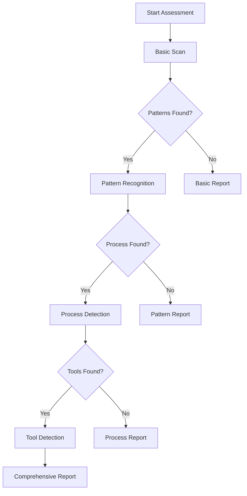

# Progressive Assessment System

## Overview

The starter kit performs intelligent, adaptive assessment based on what it discovers in your project, rather than applying a one-size-fits-all evaluation.

## Assessment Levels

### Level 1: Basic Scan
**What it looks for**:
- Project structure and organization
- Programming languages used
- Documentation presence (README, docs/)
- Basic naming consistency
- File organization patterns

**Output**: Basic maturity indicators and structural recommendations

### Level 2: Pattern Recognition
**Triggered when**: Consistent patterns detected

**What it looks for**:
- Documentation patterns (any consistent approach)
- Consistent naming conventions
- Template patterns
- Type system usage
- Code organization patterns

**Output**: Pattern maturity assessment and consistency recommendations

### Level 3: Process Detection
**Triggered when**: Process infrastructure found

**What it looks for**:
- `mission-tracker/` or similar workflow folders
- `CLAUDE.md` or agent instructions
- SDLC folders (Design/, Implementation/, etc.)
- `.cursor/rules/` or similar tool configurations
- System coordination maturity documents
- Large documentation that could benefit from sharding

**Additional Assessment**:
- Document size vs agent context windows
- Consider: Breaking large specs into focused story files
- Each story should be self-contained with its requirements
- Pattern evolves: Simple task lists (L2) → Story sharding (L3) → Agent-specialized shards (L4)

**Output**: Process maturity assessment and workflow recommendations

### Level 4: Tool Detection & Agent Specialization
**Triggered when**: Development tools detected OR multiple agent patterns found

**What it looks for**:
- `.cursor/` - Cursor IDE
- `.vscode/` - VS Code
- `.github/workflows/` - GitHub Actions
- `copilot/` - GitHub Copilot
- Multiple agent instruction files or personas
- Separation between planning and execution contexts

**Additional Assessment** (if multi-agent patterns detected):
- Context density patterns - Are planning tasks separated from execution?
- Agent role specialization - Different agents for different purposes?
- Consider: Planning agents can handle rich context, execution agents need lean focus
- AI tool configurations

**Output**: Tool-specific enhancement recommendations

## Assessment Flow



## Assessment Script Concept

```bash
#!/bin/bash
# assess-and-initialize.sh

# Level 1: Basic Scan
echo "🔍 Performing basic project scan..."
analyze_structure() {
  # Check project structure
  # Count files by type
  # Assess organization
}

# Level 2: Pattern Recognition
echo "🔎 Looking for patterns..."
detect_patterns() {
  # Search for documentation patterns
  # Check for consistent naming
  # Analyze code organization
  # Look for existing conventions
}

# Level 3: Process Detection
echo "🔍 Detecting process infrastructure..."
detect_process() {
  # Look for mission-tracker/
  # Check for CLAUDE.md
  # Find SDLC folders
}

# Level 4: Tool Detection
echo "🛠️ Identifying development tools..."
detect_tools() {
  # Check for .cursor/
  # Look for IDE configs
  # Find CI/CD setup
}

# Generate Assessment
echo "📊 Generating assessment report..."
generate_report() {
  # Create maturity assessment
  # Propose improvements
  # Generate first mission
}
```

## Assessment Output Structure

```markdown
# Project Assessment Report

**Date**: [Date]
**Project**: [Name]
**Assessment Depth**: Level [1-4]

## Current Maturity: Level [1-5]

### Evidence Found

#### Level 1 Indicators ✅
- [Specific evidence]
- File organization: [Status]
- Basic documentation: [Status]

#### Level 2 Indicators [✅/⚠️/❌]
- [Specific evidence or gaps]

#### Level 3 Indicators [✅/⚠️/❌]
- [Specific evidence or gaps]

## Strengths
1. [Specific strength with evidence]
2. [Another strength]

## Opportunities
1. [Highest priority improvement]
2. [Next priority]

## Recommended Missions

### Mission 1: [Highest Value]
**Complexity**: Simple/Standard/Complex
**Why**: [Specific reason based on assessment]
**Approach**: [Suggested approach]

### Mission 2: [Next Value]
...

## Tool-Specific Enhancements
[If tools detected, specific recommendations]

## Next Steps
1. Review this assessment
2. Choose a mission to start
3. Run: `init-mission.sh "[mission-name]"`
```

## Intelligence Features

### Adaptive Questioning
Based on findings, the assessment may ask:
- "Found mission-tracker/ - is this your primary workflow?"
- "Detected .cursor/rules/ - should recommendations be Cursor-optimized?"
- "No documentation structure found - priority on docs?"

### Pattern Learning
The assessment recognizes patterns from successful projects:
- Central navigation needs → Suggests CLAUDE.md pattern
- Documentation gaps → Recommends _*-info.md structure
- Work tracking needs → Proposes mission-tracker workflow

### Smart Recommendations
Recommendations adapt to current state:
- **Level 1 project**: Focus on basic organization
- **Level 2 project**: Add documentation infrastructure
- **Level 3 project**: Enhance process and navigation
- **Level 4 ready**: Multi-agent coordination prep

## Integration with Mission Lifecycle

After assessment, the system can:
1. Generate first mission based on gaps
2. Apply Mission Initiation Protocol
3. Create appropriate structure (Simple/Standard/Complex)
4. Set up tracking infrastructure

## Configuration Options

`starter-kit-config.yaml`:
```yaml
assessment:
  max_depth: 4  # How deep to assess
  include_tools: true  # Check for tool-specific
  generate_missions: 3  # How many to propose
  auto_init_first: false  # Auto-start first mission

output:
  format: markdown  # or json, yaml
  verbosity: normal  # minimal, normal, detailed
  include_evidence: true  # Show specific findings
```

## Benefits

### For New Projects
- Start with appropriate level of structure
- Avoid over-engineering
- Focus on highest-value improvements

### For Existing Projects
- Understand current maturity
- Get specific, actionable improvements
- Preserve what's working

### For Teams
- Consistent assessment across projects
- Clear maturity progression path
- Tool-agnostic recommendations

## Future Enhancements

### Assessment Memory
- Remember previous assessments
- Track improvement over time
- Show maturity progression

### Pattern Library Integration
- Recognize patterns from other projects
- Suggest proven solutions
- Cross-pollinate successful patterns

### Automated Mission Creation
- Generate complete mission specs
- Include acceptance criteria
- Provide implementation hints

## Usage

```bash
# Basic assessment
./assess-and-initialize.sh

# With options
./assess-and-initialize.sh --depth 4 --missions 5

# With configuration
./assess-and-initialize.sh --config my-config.yaml

# Quick assessment only (no mission generation)
./assess-and-initialize.sh --assess-only
```

The progressive assessment ensures that every project gets recommendations appropriate to its current state, making the starter kit valuable whether you're starting fresh or improving an existing codebase.